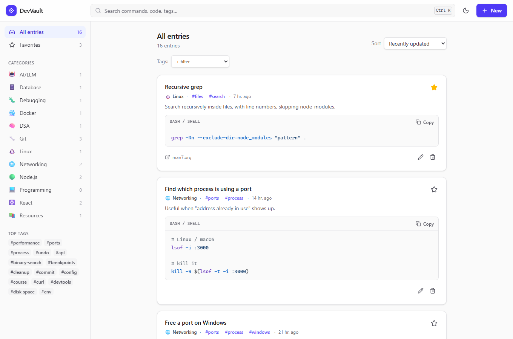

# DevVault

A personal knowledge vault for developers. Save the commands, snippets, fixes and links you learn, then find them again in seconds.

<picture>
  <source media="(prefers-color-scheme: dark)" srcset="docs/vault-dark.png">
  
</picture>

## Features

- **Full CRUD** for entries: title, description, code/command, language, category, tags, source link, favorite
- **Fast search** across titles, descriptions, code and tags. It's debounced, and matches are highlighted in the results (including inside code)
- **Filters that combine**: category + tags (match all) + favorites + search + sort + pagination. All of it lives in the URL, so refresh, back/forward and bookmarks just work
- **Syntax highlighting** for 27 languages with [Shiki](https://shiki.style). Grammars load on demand, and light/dark themes switch with pure CSS
- **Keyboard first**: `/` or `Ctrl+K` search, `N` new entry, `Esc` clears search or closes dialogs, `Ctrl+Enter` saves a form
- **Polish**: optimistic favorite toggle, copy-to-clipboard, toasts, skeleton loaders, empty/error states with retry, a confirm dialog before deleting, a warning about unsaved changes, and long code collapsed on cards
- **Dark mode** follows your OS until you pick a theme, then remembers your pick
- **Responsive**: the sidebar becomes a drawer on mobile, with no horizontal scrolling at 375 px
- **Accessible**: labelled controls, visible focus rings, native `<dialog>` focus trapping, a skip link, and ARIA for the tag combobox

## Tech stack

| Layer      | Choice                                                                         |
| ---------- | ------------------------------------------------------------------------------ |
| Language   | TypeScript everywhere (npm workspaces: `client`, `server`, `shared`)           |
| Frontend   | React 19, Vite, React Router, Tailwind CSS v4, TanStack Query, React Hook Form |
| Backend    | Node, Express 5                                                                |
| Database   | PostgreSQL + Prisma                                                            |
| Validation | Zod schemas in `shared/`, used by both the form and the API                    |
| Tests      | Vitest + Supertest (API), Vitest + Testing Library (UI)                        |

## Getting started

Requires **Node 20+**.

```bash
git clone <repo> devvault && cd devvault
cp .env.example .env
docker compose up -d        # Postgres 16 on :5432
npm install
npm run db:setup            # run migrations + seed 12 categories and 16 sample entries
npm run dev                 # API on :4000, app on http://localhost:5173
```

**No Docker?** Run `npm run db:local` in a separate terminal instead of `docker compose up -d`. It downloads and starts a real embedded Postgres with the same credentials, storing its data in `server/.data/`. Everything else is the same.

### Scripts

| Command             | What it does                                                 |
| ------------------- | ------------------------------------------------------------ |
| `npm run dev`       | API (tsx watch) and client (Vite) together                   |
| `npm run db:setup`  | Apply migrations and seed (safe to re-run)                   |
| `npm run db:local`  | Docker-free local Postgres                                   |
| `npm test`          | API tests + UI tests                                         |
| `npm run typecheck` | `tsc` across all three packages                              |
| `npm run lint`      | ESLint                                                       |
| `npm run build`     | Bundle the API to `server/dist` and the app to `client/dist` |

API tests run against a separate `test` schema in the same database (or `TEST_DATABASE_URL`), so they never touch your vault.

## API

Base path `/api`. Every error has the same shape:

```json
{
  "error": {
    "code": "VALIDATION_ERROR",
    "message": "Title is required",
    "details": [{ "path": "title", "message": "Title is required" }]
  }
}
```

| Method | Path                    | Purpose                                         |
| ------ | ----------------------- | ----------------------------------------------- |
| GET    | `/entries`              | List / search / filter (see query params below) |
| GET    | `/entries/:id`          | One entry                                       |
| POST   | `/entries`              | Create → `201`                                  |
| PATCH  | `/entries/:id`          | Partial update                                  |
| PATCH  | `/entries/:id/favorite` | Body `{ "isFavorite": true }`                   |
| DELETE | `/entries/:id`          | Delete → `204`                                  |
| GET    | `/categories`           | `[{ id, name, slug, icon, count }]`             |
| GET    | `/tags`                 | `[{ name, count }]`, most used first            |
| GET    | `/stats`                | `{ total, favorites }`                          |

`GET /entries` query params: `q` (case-insensitive, searches title/description/content/tags), `category` (slug), `tags` (comma-separated, the entry must have all of them), `favorite` (`true`/`false`), `sort` (`updated` | `created` | `title`), `page`, `limit` (max 50).

Validation: title 1–120 chars, content 1–20,000 chars, `sourceUrl` must be an http(s) URL or empty, and at most 10 tags of 1–30 chars. Tags are lowercased, a leading `#` is dropped, spaces become `-`, and duplicates are removed. Tags no entry uses any more are deleted automatically.

## Project structure

```text
shared/   Zod schemas, constants and API types used by both sides
server/   Express app (routes → services → Prisma), migrations, seed, tests
client/   React app: api/ (fetch + query hooks), components/, pages/, hooks/, lib/
```

## Deploying

- **Database**: any Postgres (e.g. Neon). Set `DATABASE_URL`, then run `npm run db:setup -w server`.
- **API**: `npm run build -w server`, then `npm start -w server`. Set `DATABASE_URL`, `PORT` and `CLIENT_ORIGIN` (the client's URL, for CORS).
- **Client**: `npm run build -w client` with `VITE_API_URL` set to the API's origin, then serve `client/dist` as a SPA (rewrite all routes to `index.html`).

There's no auth yet. Run a public demo read-only, or reset it regularly.
